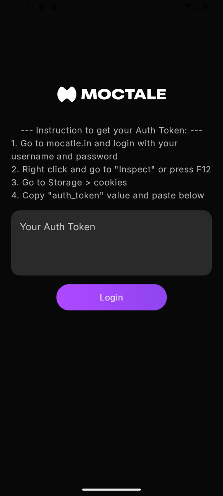
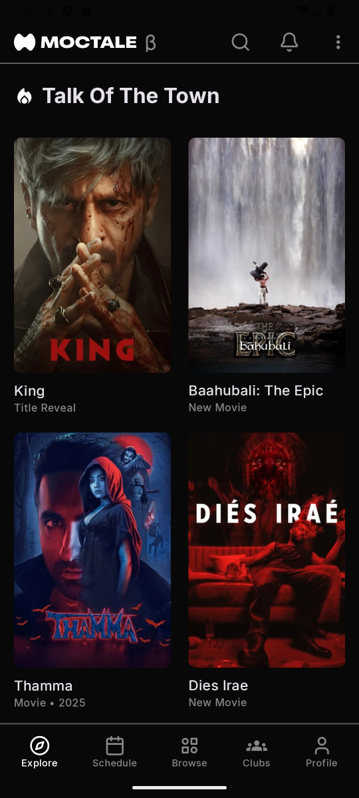
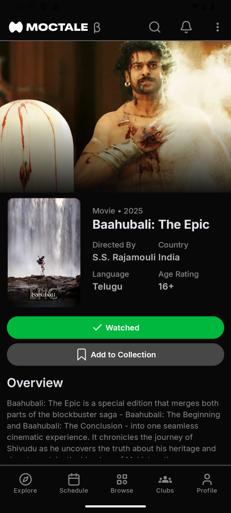
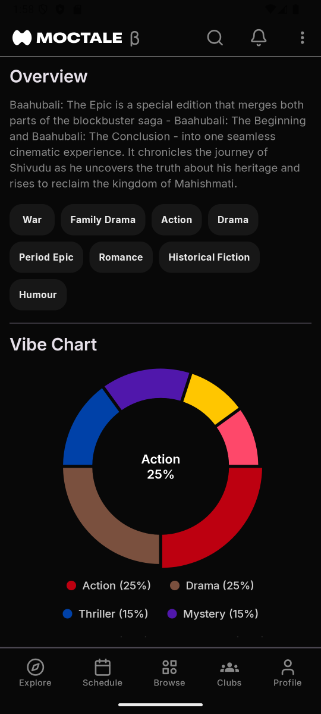
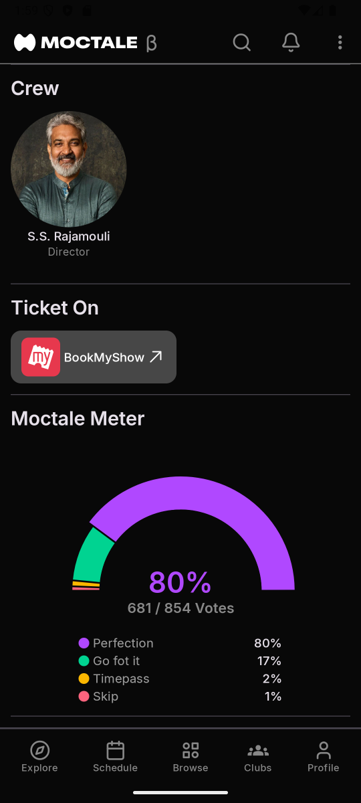
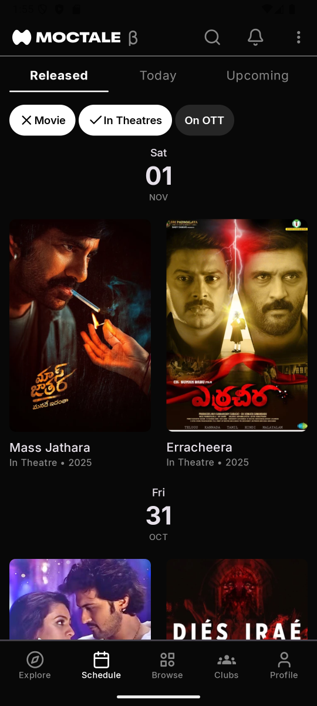
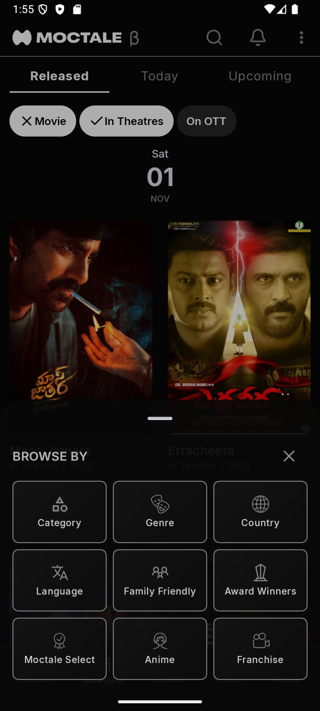
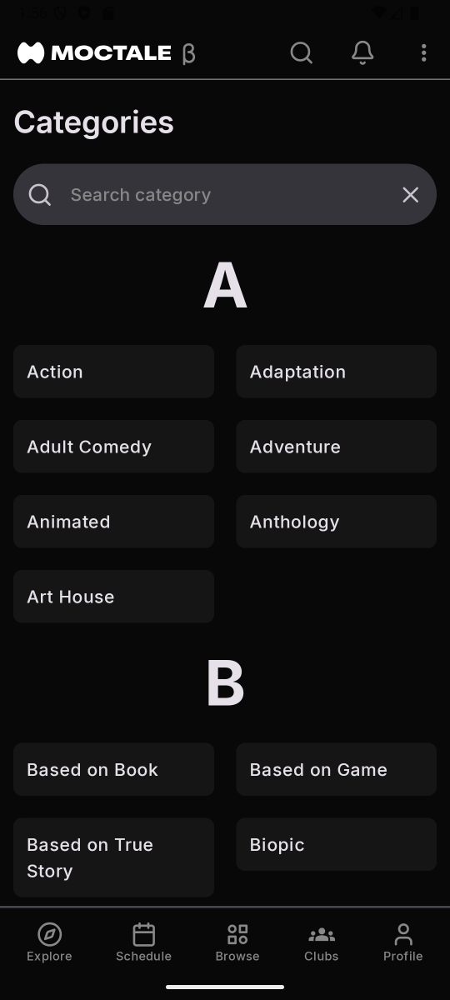
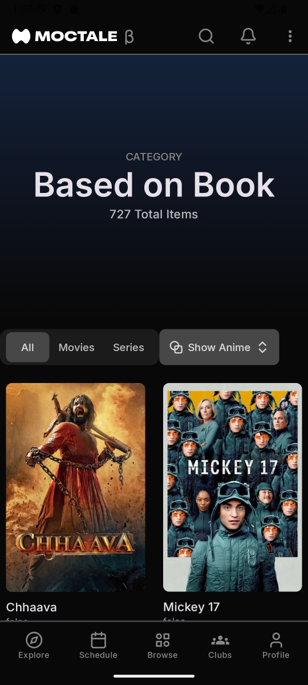
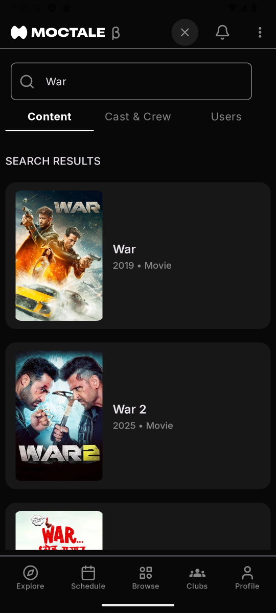

# Moctale for Android

Moctale for Android is a native Android application built with Kotlin. It enables users to seamlessly access and experience [Moctale.in](https://www.moctale.in) directly on their Android devices.
> [!IMPORTANT]  
> This project is not affiliated with Moctale.in.  
> All rights to the original content belong to Moctale.  
> This project is created for **educational purposes only**.

## ⬇️ Download

- Go to [releases](https://github.com/manishjajoriya/moctale/releases) and then download latest available version and install.
- Open the app. It is going to ask for an Auth Token. To get it
    1. Go to [Moctale.in](https://www.moctale.in) in laptop or pc and then login with your existing account or create new if no account.
    2. After login press `F12` on keyboard then go to `Storage > Cookies` and copy then your `auth_token` and save it somewhere because your are going to need this in future if re-login.
    3. Go to app and paste it.

## 🎯 Features

- 🔒 **Secure & Private:** No third-party data sharing — all authentication tokens stay safely on your device.
- ⚡ **Optimized Performance:** Fast launch time, smooth scrolling, and minimal memory usage.
- 🖼️ **Smart Image Caching:** Loads images instantly while saving data and bandwidth.
- 🧠 **Clean & Modern UI:** Simple, distraction-free interface for a seamless user experience.
- 🔁 **Consistent Experience:** Delivers the same feel and flow as Moctale, across all mobile screens.

## 📁 Project Structure

```
app/
├── src/main/java/com/manishjajoriya/moctale 
│   ├── core/base                           # 🧠 Core layer
│   │   ├── BaseViewModel.kt                # 🔄 Common ViewModel inherited by other ViewModels
│   │
│   ├── data/                               # 💾 Data layer (handles all data operations)
│   │   ├── local/                          # 🗃️ Local database (Room / SharedPref)
│   │   ├── manager/                        # 🔧 Managers for handling sessions, tokens, etc.
│   │   ├── remote/                         # 🌐 Network-related components
│   │   │   ├── api/                        # 🔗 Retrofit interfaces, API endpoints
│   │   │   └── sources/                    # 📡 PagingSource / data sources for pagination
│   │   └── repository/                     # 🧩 Repository implementations (combine local + remote)
│   │
│   ├── di/                                 # 🧴 Dependency Injection (Hilt/Dagger modules)
│   │
│   ├── domain/                             # 🧠 Domain layer (business logic)
│   │   ├── model/                          # 🧾 Data models / entities
│   │   ├── repository/                     # 🧩 Repository interfaces
│   │   └── usecase/                        # ⚙️ Use cases implementing app logic
│   │
│   ├── navgraph/                           # 🧭 Navigation graph setup (Compose Navigation)
│   │
│   ├── presentation/                       # 🎨 UI layer (Screens, ViewModels, Navigation)
│   ├── ui/theme/                           # 🎨 App theme, colors, typography, shapes
│   │
│   ├── Constants.kt                        # 🔢 App-wide constants
│   ├── MainActivity.kt                     # 🚀 Main entry activity
│   ├── MainApplication.kt                  # 🧩 Application class (Hilt / initialization)
│   ├── MainViewModel.kt                    # 🧭 Global ViewModel shared across screens
│
├── src/main/res/                           # 🎨 Resources
│   ├── drawable/                           # 🖼️ Images & vector assets (SVG)
│   ├── font/                               # ✍️ Custom fonts (e.g., Inter)
│   └── values/                             # 📚 Colors, strings, styles, dimensions
│
├── assets/                                 # 🗂️ Demo images
│
└── AndroidManifest.xml                     # 🧾 App manifest (permissions, activities, metadata)

```

## 🧰 Tech Stack

- Language: Kotlin
- Architecture: MVVM (Model-View-ViewModel)
- UI: Jetpack Compose
- Third party libraries:
    - [Retrofit](https://github.com/square/retrofit) (Network)
    - [Coil](https://github.com/coil-kt/coil) (Image)
    - [MPAndroidChart](https://github.com/PhilJay/MPAndroidChart) (Android chart)

## 🚀 Project Setup

### 🧩 Prerequisites

- 🧰 **Android Studio:** Latest stable version
- ☕ **JDK:** Version 21
- 🔗 **Git:** For cloning the repository
- **Basic understanding of Android Development is needed.**

### 📥 Clone the Project

```bash
git clone https://github.com/manishjajoriya/moctale.git
cd moctale
```

### 🏗️ Open in Android Studio

1. Launch Android Studio → click Open
2. Navigate to the project’s root folder (moctale/)
3. Wait for Gradle to sync automatically
4. If prompted, install any missing SDK components

### ⚙️ Building and Running

#### ▶️ Using Android Studio

1. Select a target device (emulator or connected physical device)
2. Click the green Run ▶️ button on the toolbar
3. The app will build, install, and launch automatically

#### 💻 Using Command Line (Gradle)

- Create a local.properties file in the project root (moctale/) if it doesn’t exist
- Add your Android SDK path:

```bash
    sdk.dir=C\:\\Users\\<YourUsername>\\AppData\\Local\\Android\\Sdk
```

- Build the debug APK from project root (moctale/):

```bash
    ./gradlew clean assembleDebug
```

- 📂 Directory of Build Debug APK Path

```bash
    app/build/outputs/apk/debug/app-debug.apk
```

## 🗺️ Future Roadmap

- [ ] Completely implement the **Browse** screen with filters
- [ ] Add **Franchise** section screen in the Browse bottom sheet
- [ ] Implement **Profile** section screen
- [ ] Add **Reviews** section in the content screen
- [ ] Enable **posting reviews** and **commenting on reviews**
- [ ] Add **Notifications** screen and **notification badges** in the app

## 📱 Preview Images

| Image 1                                                        | Image 2                                                        | Image 3                                                        |
|----------------------------------------------------------------|----------------------------------------------------------------|----------------------------------------------------------------|
|  |  |  |

| Image 4                                                        | Image 5                                                        | Image 6                                                        |
|----------------------------------------------------------------|----------------------------------------------------------------|----------------------------------------------------------------|
|  |  |  |

| Image 7                                                        | Image 8                                                        | Image 9                                                        |
|----------------------------------------------------------------|----------------------------------------------------------------|----------------------------------------------------------------|
|  |  |  |


| Image 10                                                       | Image 11                                                       |
|----------------------------------------------------------------|----------------------------------------------------------------|
|  |  | 
